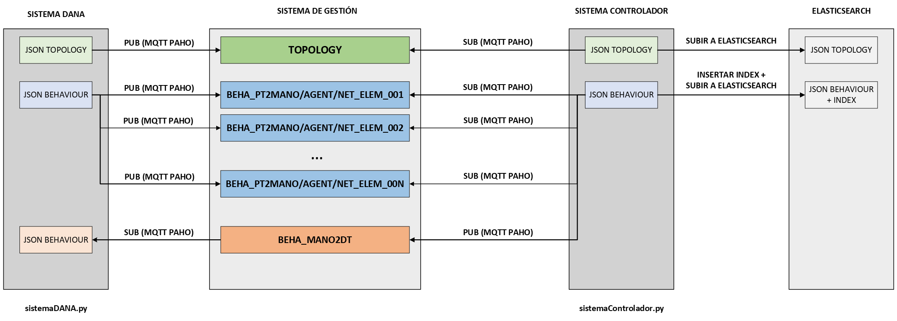

# Escenario para la comunicación entre el Physical Twin (PT) y el Digital Twin (DT)
## Introducción
El despliegue de este escenario está formado por tres sistemas: sistema DANA, sistema controlador y sistema de gestión. 

**Componentes del repositorio:**
1. **Directorio de gestión:** tfg-digital-twins/mgmt
    - **json configuración sistema monitorización:** tfg-digital-twins/mgmt/mgmt.json
2. **Directorio de topología:** tfg-digital-twins/topology
    - **jsons datos topología:** tfg-digital-twins/topology/TOPO_*.json
3. **Directorio de comportamiento:** tfg-digital-twins/behaviour
    - **jsons datos comportamiento:** tfg-digital-twins/behaviour/BEHA_*.json
4. **Fichero de configuración:** config.json
5. **Fichero de requerimientos:** requirements.txt
6. **Script de python del sistema DANA:** sistemaDANA.py
7. **Script de python del sistema Controlador:** sistemaControlador.py

En el directorio de gestión se encuentra almacenado el fichero json de configuración del sistema de monitorización, y en los directorios de topología y comportamiento, se almacenan los ficheros json que contienen los datos de topología y comportamiento, respectivamente.

El escenario cuenta con un archivo de configuración (config.json) en el que se definen campos como el path de los JSON de topología, el path de los JSON de comportamiento, la IP del Broker MQTT, el puerto MQTT a utilizar, entre otros valores necesarios. También dispone de un archivo de requerimientos (requirements.txt), utilizado para especificar las dependencias del proyecto, y por último de dos scripts de Python (sistemaDANA.py y sistemaControlador.py).

### Descripción del escenario

En el despligue de este escenario se contemplan dos estados principales:
- **Estado 0:** Monitorización del path de topología y generación del json de datos
- **Estado 1:** Monitorización del path de comportamiento y generación de los jsons de datos

**Sistema de gestión**

En el contexto de este escenario, el "sistema de gestión" se refiere a un conjunto de componentes y contenedores Docker que se encargan de coordinar y gestionar las operaciones de los sistemas desplegados, así como de administrar los servicios y recursos necesarios para su adecuado funcionamiento. Este sistema se encarga de asegurar que todos los componentes del escenario estén configurados y operativos según las necesidades del proyecto.

El sistema de gestión incluye:

**- Mosquitto MQTT (broker MQTT):** Este servicio actúa como el broker MQTT para la comunicación entre los distintos elementos del sistema, permitiendo la transferencia de mensajes y datos entre ellos. Se configura con el puerto 1883 y sin utilizar SSL/TLS.

**- Elasticsearch:** Funciona como un motor de búsqueda y análisis de datos distribuido, encargado de almacenar y procesar grandes volúmenes de datos generados por el sistema. Se configura con el puerto 9200 y sin utilizar SSL/TLS.

**- Kibana:** Es una plataforma de visualización y análisis de datos que se integra con Elasticsearch, permitiendo explorar y visualizar los datos almacenados en Elasticsearch a través de paneles interactivos y gráficos. Se configura con el puerto 5601 y sin utilizar SSL/TLS.

Tal y como se ha comentado previamente, el sistema de gestión también incluye un archivo llamado "mgmt.json" ubicado en el directorio "tfg-digital-twins/mgmt". Este archivo contiene información crítica sobre la configuración del sistema, incluido el estado actual del agente y la configuración de los servicios Mosquitto MQTT, Elasticsearch y Kibana.

En conjunto, el sistema de gestión asegura la correcta operación y gestión efectiva del entorno desplegado, proporcionando los servicios necesarios para la comunicación, almacenamiento y visualización de datos en el sistema.

**Sistema DANA**

El Sistema DANA es una herramienta diseñada para la emulación del comportamiento de un sistema en el Gemelo Físico (PT).

El sistema hace uso de la biblioteca watchdog, que se encarga de monitorizar los paths definidos en el archivo de configuración. Nada más comenzar el despligue del escenario, se inicializa por defecto el estado del agente a 0, por lo tanto se comienza con la monitorización del directorio de gestión y de topología. 

En este escenario, watchdog se encarga de monitorizar el directorio de gestión, para detectar cualquier cambio que se produzca en el archivo de configuración (mgmt.json), y de esta forma, poder controlar el cambio de estado y monitorización del directorio correspondiente. 

Una vez se encuentra en estado 0, watchdog pasa a monitorizar el directorio de topología, para detectar la creación de cualquier archivo json de datos y proceder a su correspondiente publicación en el topic TOPOLOGY. 

Una vez finalizada la publicación del json, se produce un cambio de estado (estado_agente==1), y watchdog pasa a monitorizar el directorio de comportamiento, nuevamente a la espera de la creación de un json de datos, para su posterior publicación en el topic BEHA_*. 

**Sistema Controlador**

El Sistema Controlador trabaja junto al broker MQTT, la base de datos ElasticSearch y el visualizador Kibana, encargándose de procesar la topología de la red y los datos de comportamiento, así como de gestionar la comunicación entre el Gemelo Físico y el Gemelo Digital.

Este sistema utiliza el mismo fichero de configuración que el sistema DANA, para definir parámetros como la ubicación de los archivos JSON de topología y comportamiento, la dirección IP y el puerto del Broker MQTT, entre otros. Nada más iniciar la ejecución, el controlador se suscribe al topic "TOPOLOGY" mediante el cliente MQTT de Paho. 

Al igual que el sistema DANA, este sistema hace uso de la biblioteca watchdog, que se encarga de monitorizar el directorio de gestión, para detectar cualquier cambio que se produzca en el archivo de configuración (mgmt.json), y de esta forma, poder controlar el cambio de estado y monitorización del directorio correspondiente. 

Una vez se encuentra en estado 0, watchdog pasa a monitorizar el directorio de topología, para detectar cuando se recibe un archivo json de datos en el topic TOPOLOGY. A continuación, lo procesa para obtener el listado de network_element y posteriormente, inserta esta información en la base de datos ElasticSearch.

Una vez finalizada la insercción del json en elasticsearch, se produce un cambio de estado (estado_agente==1), y el controlador se suscribe a los 'n' topics relacionados con BEHA_DT2MANO/AGENT/NET_ELEM_XXX, donde 'n' es el número de network_element obtenidos de la topología. Watchdog pasa a monitorizar el directorio de comportamiento, a la espera de que lleguen los jsons de datos de comportamiento a los topics BEHA_PT2MANO/AGENT/NET_ELEM_XXX. A continuación, el controlador los procesa para agregar un campo "comm_channel = PT2MANO" y los inserta en la base de datos ElasticSearch en el índice correspondiente. Además, publica esta información en el topic BEHA_MANO2DT/AGENT/NET_ELEM_XXX, de acuerdo a una acción condicionada, como el modo de funcionamiento establecido en el fichero de configuración o una solicitud de confirmación del operador.

El Sistema Controlador permite la comunicación bidireccional entre el Gemelo Físico y el Gemelo Digital, facilitando la sincronización de datos y el intercambio de información en tiempo real.

## Despliegue

1. Clonar el repositorio de github

