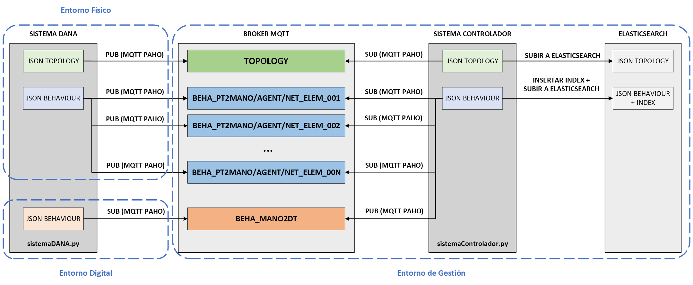

# Escenario para la comunicación entre el Physical Twin (PT) y el Digital Twin (DT)
## Introducción
<div align="justify">
El despliegue de este escenario está formado por dos sistemas: sistema DANA y sistema controlador.

**Componentes del repositorio:**
1. **Directorio de gestión:** tfg-digital-twins/mgmt
    - **JSON configuración sistema monitorización:** tfg-digital-twins/mgmt/mgmt.json
2. **Directorio de topología:** tfg-digital-twins/topology
    - **JSONs datos topología:** tfg-digital-twins/topology/TOPO_*.json
    - **Plantilla JSONs de topología:** tfg-digital-twins/topology/message.json
3. **Directorio de comportamiento:** tfg-digital-twins/behaviour
    - **JSONs datos comportamiento:** tfg-digital-twins/behaviour/BEHA_*.json
    - **Script bash generador de JSONs:** tfg-digital-twins/behaviour/generador_json_behaviour.sh
4. **Fichero de configuración:** config.json
5. **Fichero de requerimientos:** requirements.txt
6. **Script de python del sistema DANA:** sistemaDANA.py
7. **Script de python del sistema Controlador:** sistemaControlador.py

</div>

### Descripción del escenario



<div align="justify">
En el despligue de este escenario se contemplan dos estados principales:

- **Estado 0:** Monitorización del path de topología y generación del json de datos

- **Estado 1:** Monitorización del path de comportamiento y generación de los jsons de datos
</div>

**Sistema DANA**

<div align="justify">
El sistema DANA ha sido diseñado para operar tanto en el entorno del PT como en el entorno del DT, garantizando una versatilidad esencial para la implementación y gestión de gemelos digitales. 

El sistema hace uso de la biblioteca watchdog, que se encarga de monitorizar los paths definidos en el archivo de configuración. Nada más comenzar el despligue del escenario, se inicializa por defecto el estado del agente a 0, por lo tanto se comienza con la monitorización del directorio de gestión y de topología. 

En este escenario, watchdog se encarga de monitorizar el directorio de gestión, para detectar cualquier cambio que se produzca en el archivo de configuración (mgmt.json), y de esta forma, poder controlar el cambio de estado y monitorización del directorio correspondiente. 

Una vez se encuentra en estado 0, watchdog pasa a monitorizar el directorio de topología, para detectar la creación de cualquier archivo json de datos y proceder a su correspondiente publicación en el topic TOPOLOGY. 

Una vez finalizada la publicación del json, se produce un cambio de estado (estado_agente==1), y watchdog pasa a monitorizar el directorio de comportamiento, nuevamente a la espera de la creación de un json de datos, para su posterior publicación en el topic BEHA_*. 
</div>


**Sistema de gestión de red**

<div align="justify">
En el contexto de este escenario, el sistema de gestión de red (NMS) es el encargado de la comunicación entre el agente de cada gemelo, actuando como intermediario entre ambos. Este sistema segura la correcta operación y gestión efectiva del entorno desplegado, proporcionando los servicios necesarios para la comunicación, almacenamiento y visualización de datos en el sistema. 

Tal y como se ha comentado previamente, el sistema de gestión también incluye un archivo llamado "mgmt.json" ubicado en el directorio "tfg-digital-twins/mgmt". Este archivo contiene información crítica sobre la configuración del sistema, incluido el estado actual del agente y la configuración de los servicios Mosquitto MQTT, Elasticsearch y Kibana.

Este sistema está formado por los siguientes componentes:

**- Mosquitto MQTT (broker MQTT):** Este servicio actúa como el broker MQTT para la comunicación entre los distintos elementos del sistema, permitiendo la transferencia de mensajes y datos entre ellos. Se configura con el puerto 1883 y sin utilizar SSL/TLS.

**- Elasticsearch:** Funciona como un motor de búsqueda y análisis de datos distribuido, encargado de almacenar y procesar grandes volúmenes de datos generados por el sistema. Se configura con el puerto 9200 y sin utilizar SSL/TLS.

**- Kibana:** Es una plataforma de visualización y análisis de datos que se integra con Elasticsearch, permitiendo explorar y visualizar los datos almacenados en Elasticsearch a través de paneles interactivos y gráficos. Se configura con el puerto 5601 y sin utilizar SSL/TLS.

**- Sistema Controlador:** El sistema Controlador trabaja junto al broker MQTT, la base de datos ElasticSearch y el visualizador Kibana, encargándose de procesar la topología de la red y los datos de comportamiento, así como de gestionar la comunicación entre el Gemelo Físico y el Gemelo Digital.

Este sistema utiliza el mismo fichero de configuración que el sistema DANA, para definir parámetros como la ubicación de los archivos JSON de topología y comportamiento, la dirección IP y el puerto del Broker MQTT, entre otros. Nada más iniciar la ejecución, el controlador se suscribe al topic "TOPOLOGY" mediante el cliente MQTT de Paho. 

Cuando el sistema detecta que se ha recibido un archivo json de datos en el topic TOPOLOGY, lo procesa para obtener el listado de network_element y posteriormente, inserta esta información en la base de datos ElasticSearch.

Una vez finalizada la insercción del json en elasticsearch, el controlador se suscribe a los 'n' topics relacionados con BEHA_DT2MANO/AGENT/NET_ELEM_XXX, donde 'n' es el número de network_element obtenidos de la topología.

Cuando el sistema detecta que se ha recibido un archivo json de datos de comportamiento en alguno de los topics BEHA_PT2MANO/AGENT/NET_ELEM_XXX, realiza una copia del fichero y lo procesa para agregar un campo "comm_channel = PT2MANO" y posteriormente insertarlo en la base de datos ElasticSearch en el índice correspondiente. 

Una vez se han insertado los datos en elasticsearch, se publica el json original recibido en el topic BEHA_MANO2DT/AGENT/NET_ELEM_XXX, de acuerdo a una acción condicionada, como el modo de funcionamiento establecido en el fichero de configuración o una solicitud de confirmación del operador.

El sistema Controlador permite la comunicación bidireccional entre el Gemelo Físico y el Gemelo Digital, facilitando la sincronización de datos y el intercambio de información en tiempo real.
</div>


## Despliegue

1. Clonar el repositorio de github

```
git clone https://github.com/silviamh02/tfg-digital-twins.git
```

2. Instalar todas las dependencias del proyecto especificadas en el fichero de requirements.txt

```
sudo pip install -r requirements.txt
```

3. Desplegar los contenedores kibana y elasticsearch
```
sudo docker start elasticsearch
sudo docker start kibana
```

3. Moverse al directorio del repositorio

```
cd tfg-digital-twins
```

4. Ejecutar el script del sistema Controlador

```
sudo python3 sistemaControlador.py
```

En una nueva terminal, también desde el directorio tfg-digital-twins/:

5. Ejecutar el script del sistema DANA

```
sudo python3 sistemaDANA.py
```


